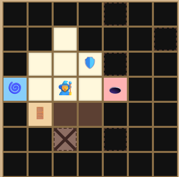
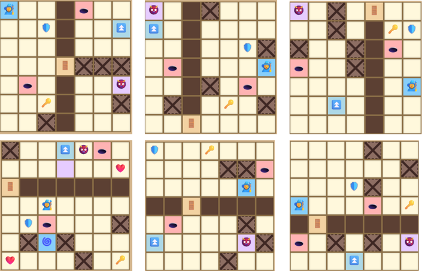
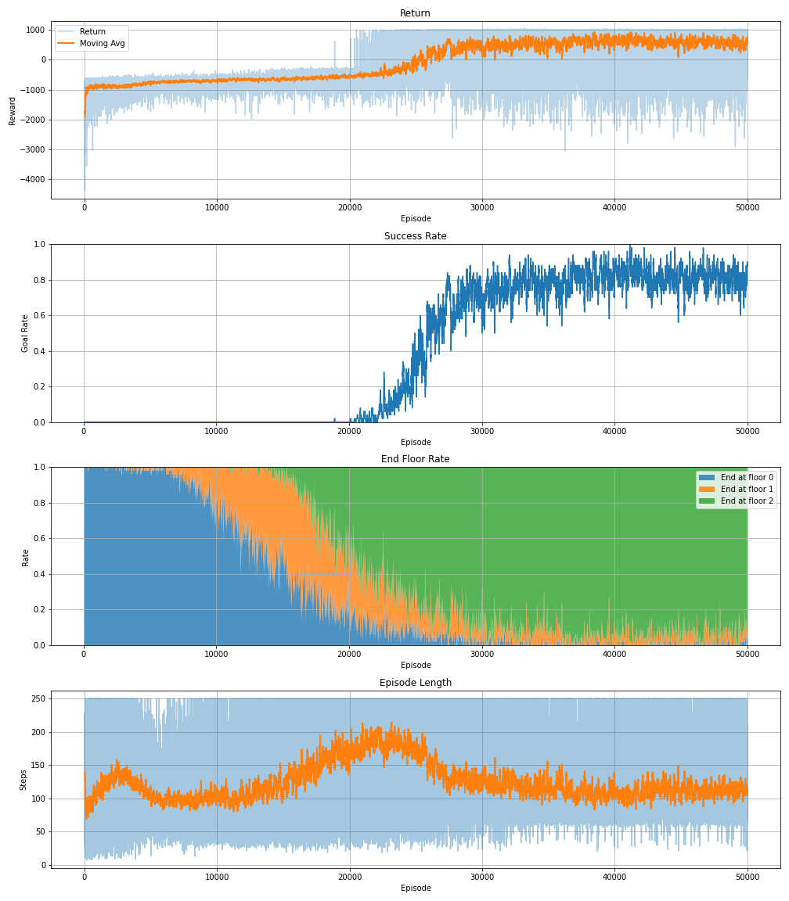
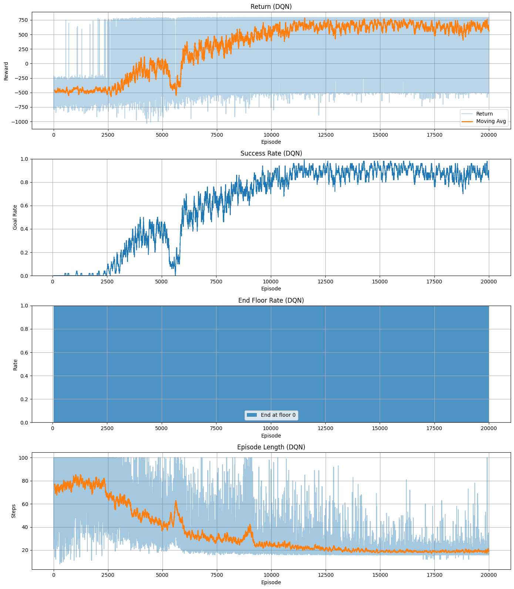
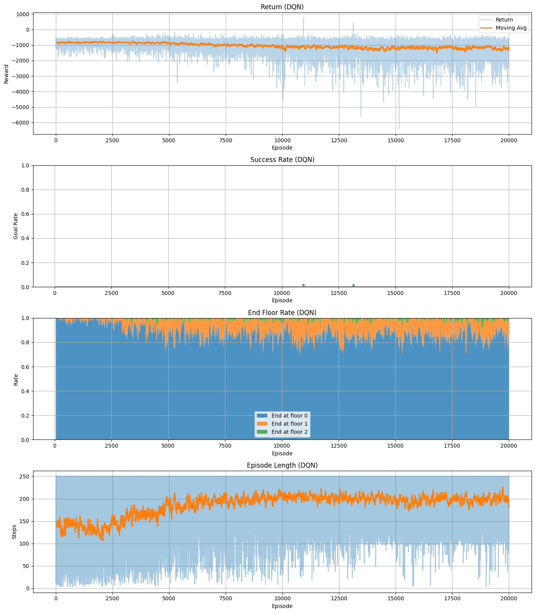

# Multi-Floor Maze RL

A custom reinforcement learning environment, a 3-floor maze with keys, doors, monsters, bombs, holes, a shield and a hammer, and a comparison of three algorithms on it: first-visit Monte Carlo control, tabular Q-learning and Double DQN (PyTorch).

This is a course project for Reinforcement Learning at HCM-UTE (team of 3, March 2026). The full report is in Vietnamese: [Nhom08_MultiFloorMaze_BaoCao.pdf](Nhom08_MultiFloorMaze_BaoCao.pdf).

Trained agents on Hugging Face: [multi-floor-maze-rl](https://huggingface.co/TicassloThang/multi-floor-maze-rl).



## Overview

- Wrote the environment from scratch: 3 floors of 7x7 cells, each floor built from one of 6 wall patterns with a random door, and checked with BFS so that ENTRY, KEY, DOOR and STAIRS (or GOAL) are always reachable in order.
- Designed a 19-value observation, 9 actions (4 moves, hammer in 4 directions, wait) and a shaped reward with guards against reward hacking (stagnation stop, hammer cooldown longer than the monster stun, no reward for picking up health at full HP).
- Implemented Monte Carlo control, Q-learning and a multi-branch Double DQN with action masking, experience replay, a soft-updated target network and Huber loss.
- Trained them in phases of increasing difficulty and compared success rate, reward, episode length and how episodes end.
- Built a playable UI in Apache Zeppelin to play the maze by hand or watch a trained agent.

## The environment

| Element | What it does |
|---|---|
| KEY, DOOR | The door on each floor opens only if the agent holds the key |
| STAIRS, GOAL | Stairs go up one floor; the goal is on the last floor |
| MONSTER | One per floor. Chases the agent when within Manhattan distance 3 (misses a step 35% of the time), otherwise wanders. A hit costs 1 HP and sends the agent back to the floor entry |
| BOMB, HOLE | Cost 1 HP. A hole also sends the agent back to the floor entry |
| SHIELD | Blocks one hit from a monster, bomb or hole. Blocking a monster also stuns it for 2 steps. Lost when the agent goes up a floor |
| HAMMER | Hits the next cell: stuns a monster, breaks a soft wall or removes a bomb. 3 step cooldown |
| SOFT_WALL | A wall the hammer can break |
| BLOOD | Restores 1 HP (max 3) |

Bombs and health also appear during an episode, every 5 to 7 steps, away from the agent. An episode ends on the goal, on death (HP 0), at the step limit (250 by default), or after 38% of the step limit (95 steps at 250) without reaching a new milestone (key, door, stairs or goal).



**Observation** (19 values): floor, low/ok HP, has key, has shield, the cell types in 12 cells around the agent (4 next to it, 4 two steps away, 4 diagonal), where the monster is among those cells, whether it is stunned, and whether the hammer is ready.

**Main rewards**: step -0.3, wait -0.5, invalid move -3, key +35, door +45, first time on new stairs +60, goal +700, bomb -12, hole -28, monster hit -22, death -520, timeout -220, stagnation -180, plus a small bonus for new cells and a penalty for revisiting a cell more than 3 times. The full table is in the report (Bảng 5).

## Algorithms

| | Monte Carlo control | Q-learning | Double DQN |
|---|---|---|---|
| Value storage | Table of return sums and counts per (state, action) | Q-table per (state, action) | Neural network |
| Update | First-visit, after each episode | TD update after each step | Minibatch from a replay buffer |
| Exploration | Epsilon-greedy over valid actions, decaying epsilon | Same | Same, with invalid actions masked out |
| Code | [`src/monte_carlo.py`](src/monte_carlo.py) | [`src/q_learning.py`](src/q_learning.py) | [`src/double_dqn.py`](src/double_dqn.py) |

The Double DQN network splits the observation into 3 groups and gives each its own layer before joining them: the 12 local cells (one-hot over the 13 cell types, so 156 inputs), agent status (4) and context (3). Each branch is Linear + ReLU with 128 units, then a linear layer outputs 9 Q-values. Training uses Adam (learning rate 3e-4), gamma 0.98, batch 64, a 200,000 transition buffer, soft target updates (tau 0.005), Huber loss and gradient clipping.

## Results

Each method was trained in phases. Each phase continues from the previous one's model. Monte Carlo and Q-learning ran 50,000 episodes per phase on the full 3-floor maze; Double DQN ran 20,000 episodes per phase and added floors one at a time. Success rate is the share of episodes that reach the goal, measured on the last training episodes (with exploration still on).

| Phase | Setting | Monte Carlo | Q-learning | Double DQN |
|---|---|---|---|---|
| 1 | Fixed map, no soft walls or bombs (DQN: 1 floor, with soft walls and bombs) | 0% | 80 to 85% | 89% |
| 2 | Fixed map, 5 soft walls, up to 2 bombs (DQN: 2 floors) | 0% | about 50% | 87% |
| 3 | Tabular: random map. DQN: fixed map, 3 floors | 0% | 0% | 33% (best 41%) |
| 4 | DQN only: random map, 3 floors | | | 0% (2 goals in 20,000 episodes) |





What we learned:

- **Q-learning beats Monte Carlo on fixed maps.** Monte Carlo only updates at the end of an episode, and with the goal so far away most episodes end in stagnation or a timeout without any big positive reward to learn from. Q-learning passes the key, door and stairs rewards back step by step.
- **Tabular methods break on random maps.** With a new layout every episode, the Q-table grew to about 3.9 million (state, action) pairs without settling, and neither method reached the goal.
- **Double DQN learns 1 and 2 floors well but not the full random maze.** It reached 89% and 87% on fixed 1 and 2 floor mazes, only 33 to 41% on the fixed 3 floor maze, and nothing on random 3 floor maps (most episodes end on the first floor).



### Greedy evaluation

The notebook also runs each saved model greedily (no exploration) for 1,000 episodes on the 3-floor fixed map:

| Saved model | Goal | Death | Timeout | Stagnation | Average reward |
|---|---|---|---|---|---|
| Q-learning, phase 2 | 703 (70.3%) | 81 | 25 | 191 | +566.96 |
| Monte Carlo, phase 2 | 0 | 4 | 65 | 931 | -1026.24 |
| Double DQN, phase 3 | 0 | 211 | 0 | 789 | -725.21 |

The Double DQN result here is much worse than its training log (33% in phase 3). We did not find the cause during the project. One possibility is that the fixed map in this evaluation is not the same layout as the one used for training on Colab, so this number should be read with care.

## Limitations

- The observation only sees 12 nearby cells, so the agent has no idea where the key, door or stairs are when they are far away.
- Tabular methods cannot generalize to new layouts, and the flat multi-branch MLP was not enough for random 3 floor maps either.
- 20,000 to 50,000 episodes per phase may be too few for the harder phases.
- The report suggests a CNN over the grid, PPO or A3C, hierarchical RL and curriculum learning as next steps.

## Tech stack

Python, NumPy, PyTorch, Matplotlib, Apache Zeppelin (with an AngularJS game UI), Google Colab

## Project structure

```
├── notebooks/
│   ├── MultiFloorMaze_Zeppelin.json     # Full project: environment, game UI, MC, Q-learning, DQN, evaluation
│   └── DoubleDQN_4Phases_Colab.ipynb     # Double DQN training on Colab (4 phases, with plots)
├── src/                                  # The notebook code split into files for reading on GitHub
│   ├── maze_env.py                       # Constants, monsters, floor generation, MazeEnv, reward settings
│   ├── monte_carlo.py
│   ├── q_learning.py
│   └── double_dqn.py
├── assets/                               # Images for this README
├── Nhom08_MultiFloorMaze_BaoCao.pdf      # Report (Vietnamese)
└── Nhom08_MultiFloorMaze_BaoCao.docx
```

The files in `src/` are copied cell by cell from the Zeppelin note; only the `%pyspark` line at the top of each cell is removed. Some helpers call Zeppelin's `z` object for the game UI, so they are meant for reading; run the notebook to use them.

## Run it

1. Install [Apache Zeppelin](https://zeppelin.apache.org/) (we used 0.8.2) with a Python interpreter. We used Python 3.7.9, NumPy 1.21.6, Matplotlib 3.5.3 and PyTorch 1.13.1 (CPU).
2. Import `notebooks/MultiFloorMaze_Zeppelin.json` in Zeppelin and run the cells in order. The game UI cells let you play the maze with buttons.
3. To evaluate the trained agents, download them into a `FinalModel/` folder next to where Zeppelin runs the note:

```bash
hf download TicassloThang/multi-floor-maze-rl --local-dir FinalModel
```

The models are also on [Google Drive](https://drive.google.com/file/d/1bmuVvRVXxPWJzh1-obrytvrWvYSr7aFL/view?usp=sharing).

To train Double DQN, open `notebooks/DoubleDQN_4Phases_Colab.ipynb` in Google Colab. It saves checkpoints to Google Drive.

## Team

Huỳnh Ngọc Thắng (team lead), Huỳnh Thanh Nhân, Trương Tấn Sang. We built the environment, the algorithms, the experiments and the report together.

## License

[MIT](LICENSE)
